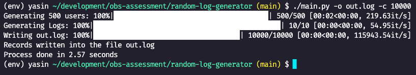

# Random Logs Generator

Random logs file generator tool.

## Installing Dependencies

- Install [Python](https://www.python.org/downloads/)
- Generate a virtual environment
```
python -m venv env/
```

- Activate environment
```
./env/bin/activate
```

- Install requirements file
```
python -m pip install -r requirments.txt
```


## Make script executable

```
chmod +x *.py
```

## Main Script Usage

usage: `main.py [-h] [-o output_file] [-c lines_count]`

A random logs file generator tool

options:
  `-h, --help`            show this help message and exit
  `-o` `output_file`, `--output` `output_file`
                        File to write generated content into. Default is `output.log`.
  `-c` `lines_count`, `--count` `lines_count`
                        Count of lines to be generated. Default is 100.

## Generator Example

```
./main.py -o output_file.log -c 1000000
```

the above example will generate 1M records and store it into `output_file.log`.
<!--  -->


## Analysis Script Usage

usage: `analytics.py [-h] -f file`

Analyses a given log file.

options:
  `-h`, `--help  `          show this help message and exit
  `-f file`, -`-file file`  File to be analysed.


## Analytics Example

```
./analytics.py -f out.log
```

